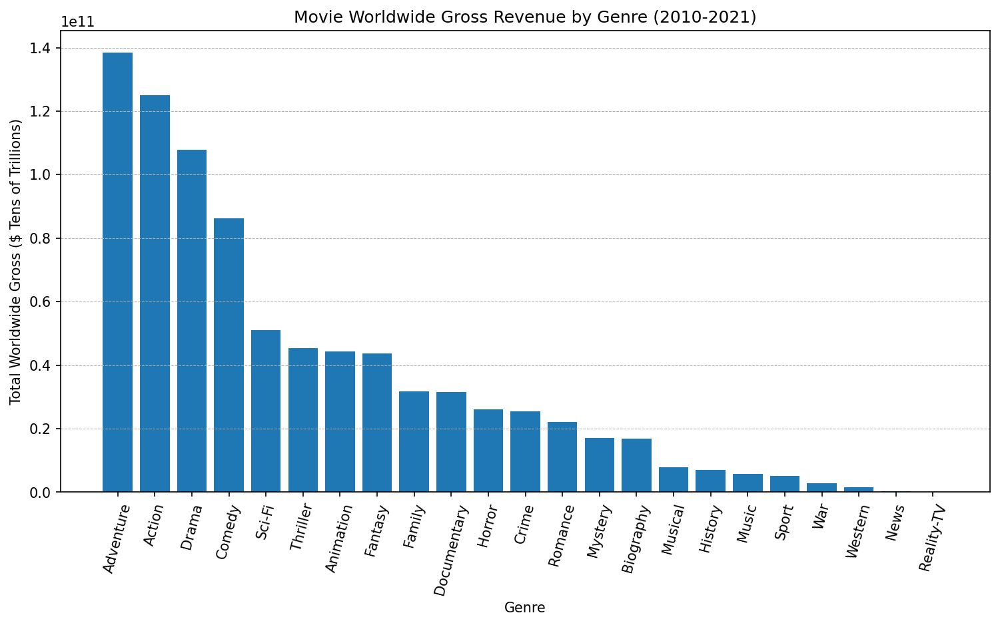
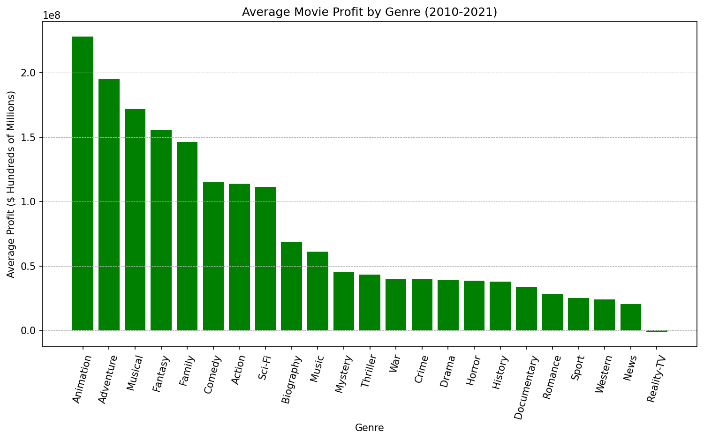

# MOVIE DATA ANALYSIS
by Michael Kearns

# Business Understanding

The company is creating a new movie studio and needs insight into which types of movies to make. My analysis will provide information on which types of movies have had the most success in recent years, and I will provide suggestions to the head of the movie studio on how to proceed. 

# Data Understanding

The datasets used for this analysis come from multiple online sources that collect relevant movie information, such as genre, release date, viewer reviews/ratings, gross revenue, etc. The datasets may not be directly linked or related as each source uses different formatting depending on the information it holds. Therefore, extra preparation is needed to develop significant insight.

Categorizing the data by genre is the most important strategy to determine movie success as it will directly answer the current business problem.

## Data Preparation

Data from multiple datasets will be joined together to produce any significant findings. Primarily, movies will need to be grouped based on their genre. From there, revenue and profits can be determined, as well as viewer reviews.

Many movies have multiple genre types, therefore, the genre of each movie will need to be separated so that movies can be grouped into the correct group. If a movie is categorized as "Action" and "Drama" then the data will be included in both groups.

The financial success of movies is a significant factor. With the current form, gross revenue is formatted as a string and will be converted to floats for easier analysis. 

# Exploratory Analysis

Adventure, Action, and Drama movies have the highest gross worldwide revenue from 2010-2011. They are the only genres that reach over the $10 Trillion mark. The revenue levels have a significant drop off after comedies.

Animation has the highest profit. That could be due to lower production costs for animated movies compared to an Action or Adventure movie that may require special sets, equipment, and stunts.

The average movie viewer rating is similar across genres. Targeting a highly rated movie based on a specific genre may not result in a successful outcome.

## More Information

Please refer to my [jupyter notebook](./Movie_Data_Analysis.ipynb) for the complete analysis and my [presentation](./Movie_Data_Analysis_Presentation.pdf) for additional information.

# Conclusion & Recommendations

Based on this analysis I recommend the following three business actions:

1. The top genre of movies to make should be **Action and Adventure**. These genres bring in at least $0.25 Trillion in gross worldwide revenue compared to other genres. These types of movies will help bring in money to the studio.
2. Create a consistent lineup of **Animated** movies to ensure the company is making a profit. Animated movies will have the best profit margins due to lower production costs. This will also help appeal to a wider audience.
3. *Do not* target specific viewer ratings for movies. View ratings are similar across genres. Similarly, *do not* limit or set specific movie lengths. Runtime does not have a clear impact on viewer ratings. Therefore, focus on the production and story quality of our movies. 

## Next Steps

The next steps for the movie studio could be to focus on specific writers, directors, producers, or actors to sign on to create movies. Additional analysis could be performed to determine which individuals have had significant success in the industry and could help get the studio up and running. 
